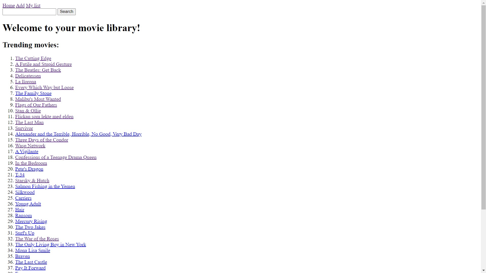

# My Movies List using [MoviesMiniDatabase API](https://rapidapi.com/SAdrian/api/moviesminidatabase)

## Table of contents    

- [Overview](#overview)
  - [Functionality](#functionality)
  - [Screenshots](#screenshots)
- [My process](#my-process)
  - [Built with](#built-with)
  - [What I learned](#what-i-learned)
  - [Continued development](#continued-development)

## Overview

### Functionality
This web application allows users to:
* View the top 50 most popular movies on the homepage.
* Search for a movie.
* Click on a movie to view its details.
* Add/remove a movie to their list. Edit the description and add a personal rating to a movie in the list.
* View their list of movies.
* Sort the movies in the list by rating/personal rating/date released

### Screenshots

**Homepage**

**Search**

**Movie page**

**Saved movie**

**Edit a saved movie**

**List of user-selected movies**

**Sort options**

## My process

### Built with
- python Flask
- HTML markup
- Jinja templates
- [Movies API](https://rapidapi.com/SAdrian/api/moviesminidatabase)
- python 'requests' library

### What I learned

I have gained experience working with web APIs.

Learned how to send GET requests using the Python request library.

Improved my website routing skills. 

Improved my Jinja template-building skills.

Improved my server-side form processing skills.

### Continued development
There are a lot of things that could be added to this project. To name a few:
- Adding CSS styles and a responsive CSS framework (Bootstrap).
- List movies in different formats (with, without images, title only, title & description, title & rating)
- Adding client-side form validation to prevent invalid input.
- Ask for confirmation when deleting a movie

The biggest thing that is logical to add to this project is a database. A database would allow the users to:
- Register an account.
- Store their movies list in the database.
- View other user's personalized movie lists (if those lists are declared as 'public')
